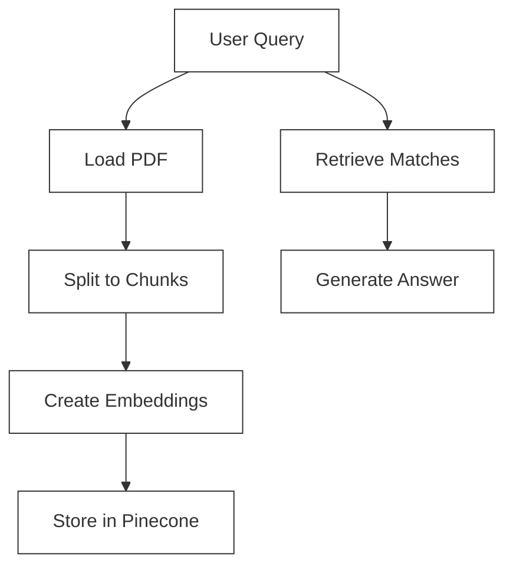
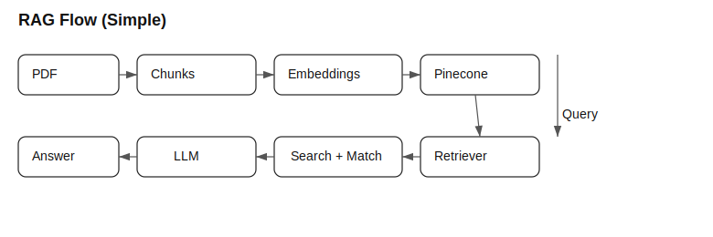

# RAG Application

A question-answering system that leverages LangChain, Pinecone, and OpenAI to provide insights from budget speech documents.

## Features

- Extract and process PDF documents
- Split content into manageable chunks
- Generate embeddings using OpenAI
- Store and retrieve documents using Pinecone vector database
- Answer natural language questions about the content

## Prerequisites

- Python 3.8+
- OpenAI API key
- Pinecone API key

## Installation

1. Clone the repository:
   ```bash
   git clone <repository-url>
   cd rag-app
   ```

2. Create and activate a virtual environment:
   ```bash
   python -m venv venv
   source venv/bin/activate  # On Windows: venv\Scripts\activate
   ```

3. Install dependencies:
   ```bash
   pip install -r requirements.txt
   ```

4. Create a `.env` file in the root directory and add your API keys:
   ```
   OPENAI_API_KEY=your_openai_api_key_here
   PINECONE_API_KEY=your_pinecone_api_key_here
   ```

## Usage

1. Place your PDF file (e.g., `budget_speech.pdf`) in the project root directory.

2. Run the main script:
   ```bash
   python main.py
   ```

3. The script will:
   - Process the PDF document
   - Create embeddings
   - Store them in Pinecone
   - Answer questions about the document

## Architecture and Flow

The following flow mirrors the actual code in `main.py`:



### Key Steps
1. **Document Processing**
   - Load PDF and split into chunks
   - Generate embeddings for each chunk
   - Store in vector database (Pinecone)

2. **Query Processing**
   - User submits a query
   - System retrieves relevant chunks
   - LLM generates answer using context

## Static Diagram

Rendered image for environments without Mermaid support (simple, white background):


## Example Query

```python
query = "What are the key highlights of the budget?"
answer = retrieve_answers(query)
print(answer)
```
